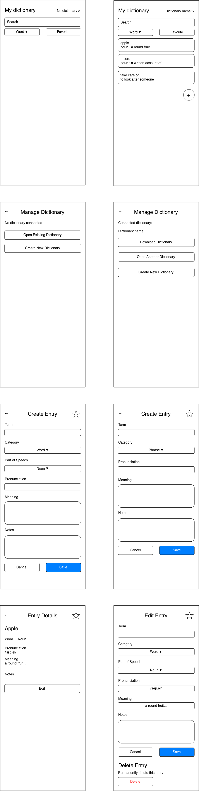

# Architecture

## Workflow
### Create a dictionary
- Create a dictionary and download it to local

    Frontend | Backend
    -|-
    Create a dictionary request |
    ||Create SQLite database
    ||Generate `DbId` 
    ||Send `DbId` to Frontend
    Save `DbId` in browser local storage|

### Open a dictionary 
- Open a dictionary

    Frontend | Backend
    -|-
    Open a SQLite database |
    Send it to Backend|
    ||Generate `DbId` 
    ||Send `DbId` to Frontend
    Save `DbId` in browser local storage|

### Database workflow
- Users upload a SQLite database to backend
- Copy it as a working copy
- Apply migration at runtime to working copy

### Download a dictionary
- Download a dictionary to local

    Frontend | Backend
    -|-
    Download a dictionary request |
    ||Send db with `DbId` to Frontend
    Allow user to save the database|

## TTL (time to live) cleanup
### TTL
- Get the database last accessed time, cleanup the database that is idle for 24 hours

### Cold start
- App cold start -> CleanupExpiredDatabases() -> start API -> BackgroundService cleans up temporary dictionary periodically

## UI
### Landing page
- If there is a connected dictionary:
    - `DbId` in Frontend
    - Temporary db in Backend

    ```
    The connected dictionary: dictionary name
    Download
    ```

- If there isn't a connected dictionary:
    - Only show "Connection"

- Browse all the entries with pagination
    - With edit

### Connection 
- Create and open

    ```
    Create a new dictionary
    Open an existing dictionary
    ```

### Search
- Based on word, phrase, and favorite

### Edit page
- Edit
- Remove with confirmation

### Create
- Create an entry

### Design
- Design

    

## SQLite
### Category schema
- Id
- Name

- Insert "Word", "Phrase" directly

### Entry schema
- Id
- Term
- Pronunciation
- Meaning
- Notes
- IsFavorite
- CategoryId
- CreatedAt

- The relationship between `Category` and `Entry` is one-to-many, therefore `Category` is the principal entity, `Entry` is the dependent entity

# To do
## Version 1
### Miscellaneous
- The connection string depends on `DbId`
- TTL cleanup

### `DictionaryDbManager`
- Create SQLite database
    - Backend (Done)
    - Frontend
    - Logging

- Open SQLite database
    - Backend
    - Frontend

- Download SQLite database
    - Backend
    - Frontend

### `EntryRepository`
- Read entries based on `DbId`
- Insert entries based on `DbId`
- Edit entries based on `DbId`
- Delete entries based on `DbId`

### Dictionary name
- Directly save dictionary name in SQLite database (Done)

    ```
    The connected dictionary: dictionary name
    ```

### Pop up
- Manage Dictionary

    ```
    Your changes haven't been downloaded.
    Continue anyway?
    ```

- Edit Entry

    ```
    Delete “Apple”?
    This action cannot be undone.
    ```

## Verson 2
### Add category
- Add CRUD category operations